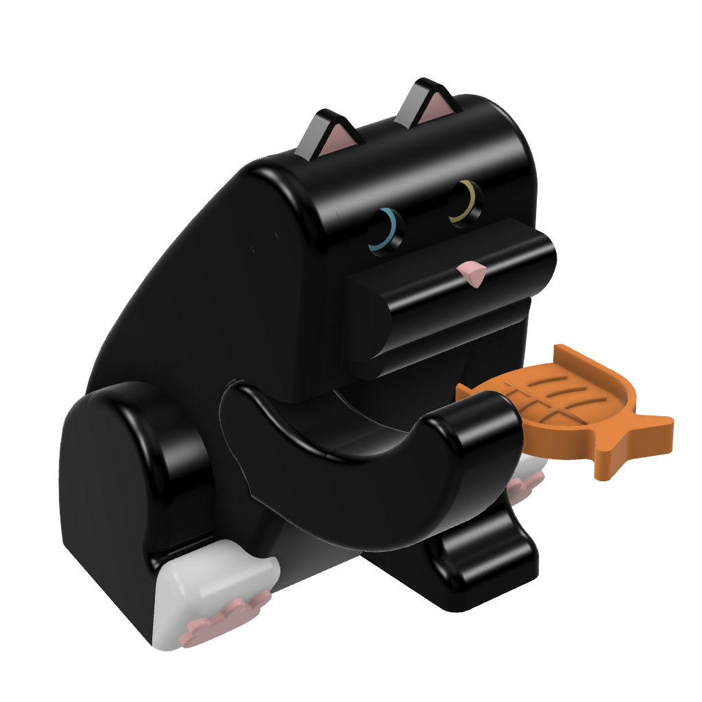
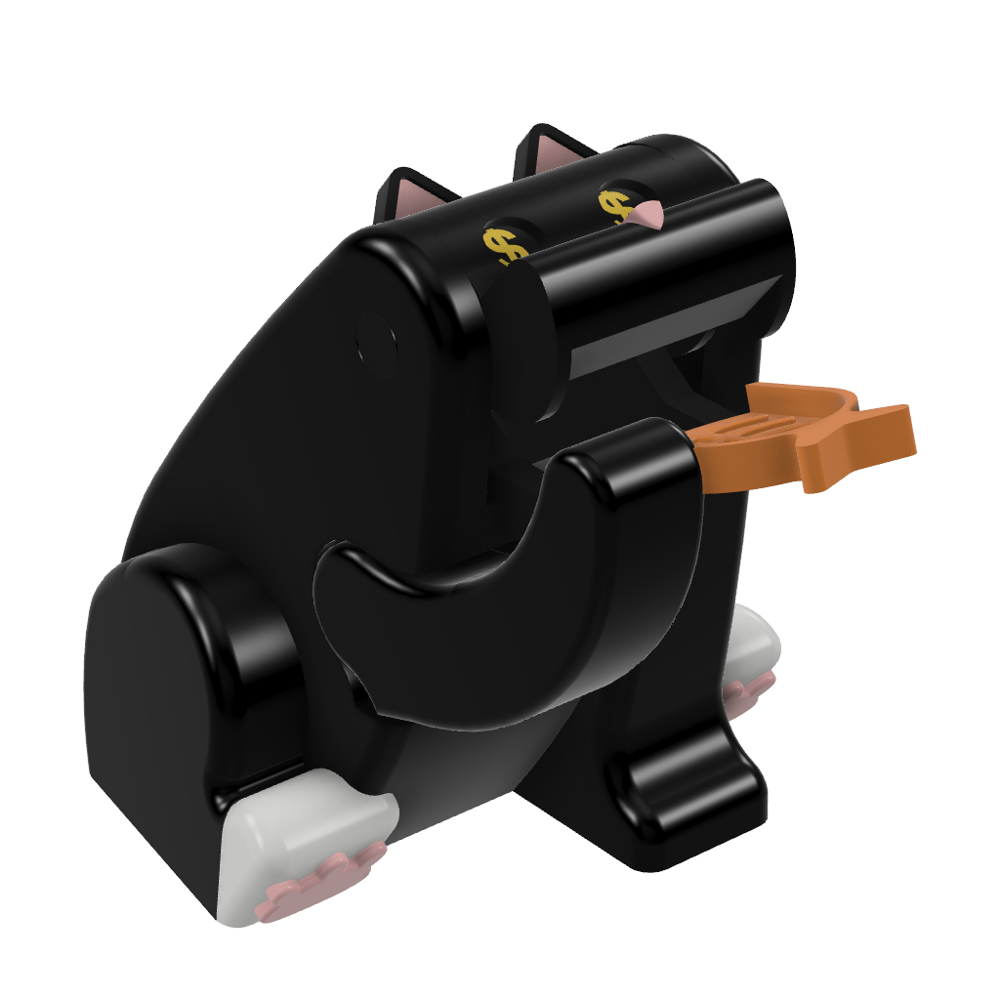
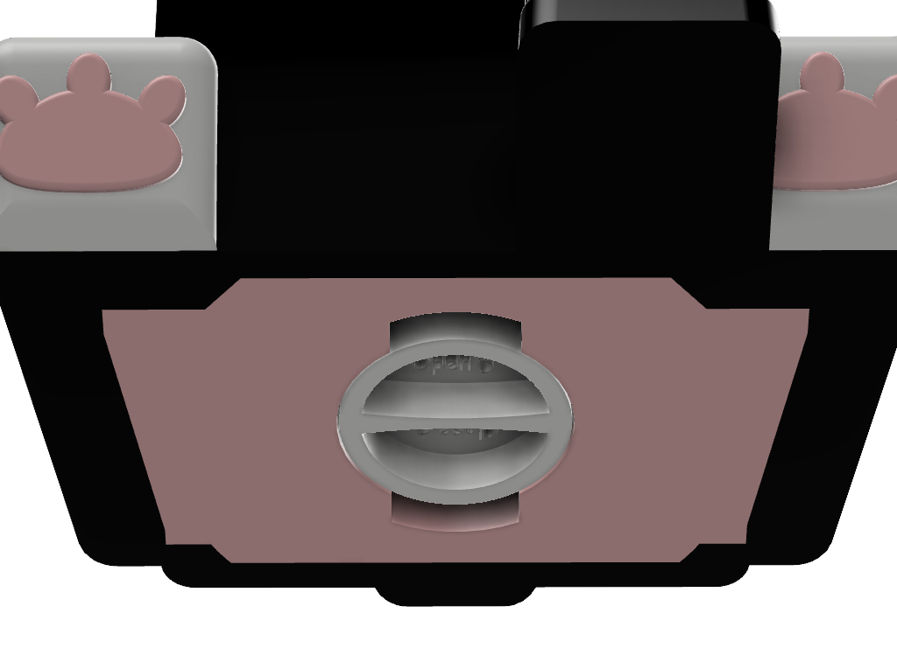

# Bear Coin Bank

### Short description
The mechanism that I chose for the final project is a bear coin bank. When inserting coins, the bear's mouth opens and the coin slips inside the bank. I chose this project because it's both useful and adorable.

### How it works

The bear coin bank works by pushing the bear's ears, which elevates the hand with the tray, and the coin slips inside the bear's mouth. The coins can be collected by opening the bottom cap.

### Components
* body;
* head;
* arm;
* eyes;
* jaw;
* bottom cap;
* arm slide;
* left spring;
* right spring.

### Joints

For the main motion I created 3 joints:
* Head - Body (Revolute);
* Slider - Body (Slider);
* Arm - Body (Revolute).

I added 2 motion links between these joints, named _Head-Slider_ and _Slider-Arm_. When the _Head_ rotates, it pushes the _Arm Slide_ component.  
The _Arm Slide_ pushes the end of the _Arm_ and determines its rotation. The _Head-Slider-Arm_ motion study shows how this motion works.

https://user-images.githubusercontent.com/76184859/119259722-35826480-bbd8-11eb-92a2-ba6e3ec79650.mp4

&nbsp;

For the cap motion, I added a Cylindrical joint named _Cap-Body_. 
I created a _Cap_ motion study: the cap rotates to 90 degrees and then it slides down. The reverse motion is used to close the cap.

https://user-images.githubusercontent.com/76184859/119259893-028ca080-bbd9-11eb-88d8-5b859e7ca01a.mp4

&nbsp;

I created another .f3d file named _Demo_, which shows how the coin is inserted inside the bank.
It contains all the components and motion features as the main project, and besides them, I added a _Coin_ component, a pin-slot joint named _Coin-Body_ and a motion study that shows the relation between the _Head-Body_ and _Coin-Body_ joints.
  

https://user-images.githubusercontent.com/76184859/119260120-066cf280-bbda-11eb-9f37-cb27952eca80.mp4

#### Finished mechanism

    

### Checkpoints
##### Checkpoint 1:
- chose project;
- created main components.

##### Checkpoint 2:
- decided to model a cat coin bank instead of a bear coin bank;
- created the body;
- started designing the head and the eyes.

##### Checkpoint 3:
- finished the head, eyes and mouth;
- added appearance.

##### Checkpoint 4:
- finished all components;
- added joints, motion links, motion studies;
- created a demo project;
- rendered the mechanism;

### Renderings
The renderings were made in the _Demo_ file. I used the _Rim Highlights_ environment.  

    

  

### Software and files
The software I used to create and render this project is _Fusion 360_. The whole project is saved as an _.f3d_ file and each body is saved as an _.stl_.  
Other file types: .png, .jgp, .mp4, .gif.

### Credits

 
  

