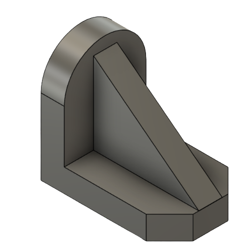
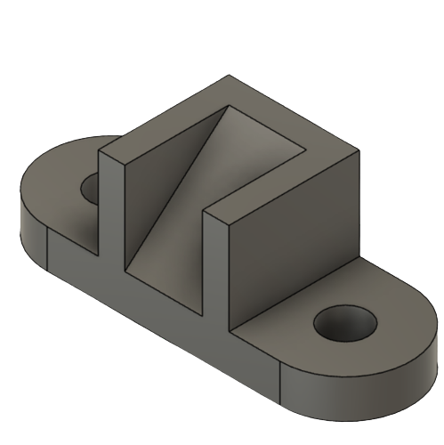
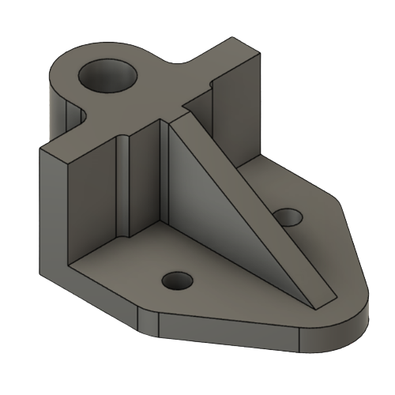
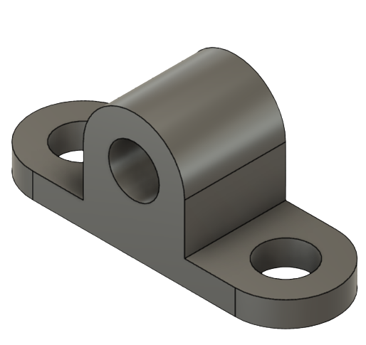

# Homework #2
This folder contains:  
- a remixed model from Thingiverse;

- 4 models designed after the [isometric schemes](https://drive.google.com/drive/folders/16N1ziNJJ3GGEMqk-bpYgEOiDIbeWBGdc).

   

